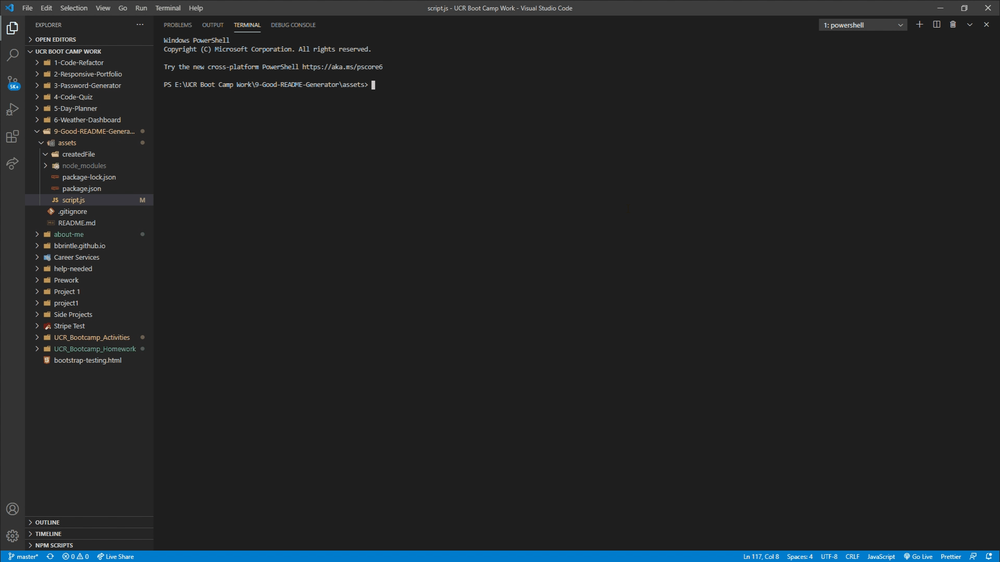
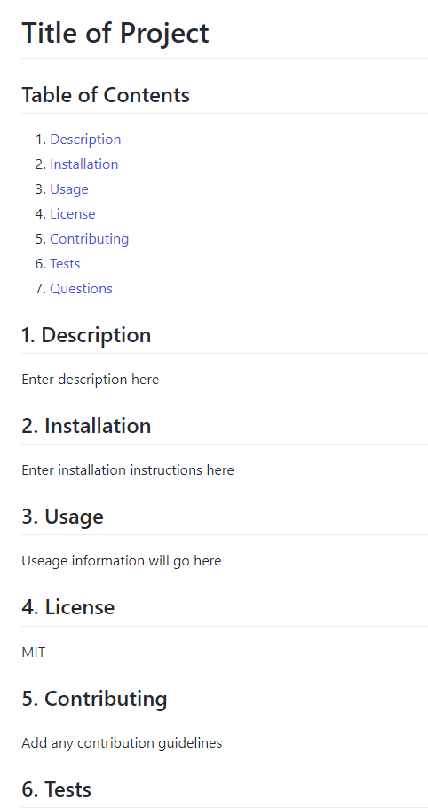

# Good README Generator

## Table of Contents
1. [ Description ](#desc)
2. [ Installation ](#install)
3. [ Usage ](#usage)
4. [ License ](#lic)
5. [ Questions ](#quest)
    

## 1. Description
When creating an open source project on GitHub, it is important to have a quality README with information about the app--what is the app for, how to use the app, how to install it, how to report issues, and how to make contributions so that other developers are more likely to use and contribute to the success of the project. A command-line application will allow for quick and easy generation of a project README to get started quickly. This will allow a project creator to spend more time working on finishing the project and less time creating a good README.
    

## 2. Installation
Make sure to have the package.json file in the folder then type "npm install" in your terminal. The neccessary files will install automatically.
script.js file must be ran using node.js from the ./assets/ folder
    

## 3. Usage

    

## 4. License
MIT
    

## 5. Questions
Please visit my GitHub to view all of my work:
https://www.github.com/bbrintle 

Contact me at: bbrintle@gmail.com